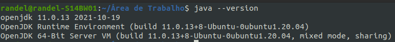

<div align="center">

<p style="font-size: 35px"><strong>Academia Técnica Capgemini 2022! DESAFIO DE PROGRAMAÇÃO :rocket: </strong></p>
</div>


# :computer: Desafio de Código Capgemini
O objetivo dessa etapa é testar os conhecimentos em lógica de programação. Para isso, foram preparadas três questões com diferentes níveis de dificuldade.

## :page_with_curl::one: Questão 01
Escreva um algoritmo que mostre na tela uma escada de tamanho n utilizando o caractere *
e espaços. A base e altura da escada devem ser iguais ao valor de n. A última linha não deve conter
nenhum espaço.

**Exemplo:**

**Entrada:**

```
n = 6
```

**Saída:**

```
     *
    **
   ***
  ****
 *****
******
```

## :page_with_curl::two: Questão 02
Débora se inscreveu em uma rede social para se manter em contato com seus amigos. A
página de cadastro exigia o preenchimento dos campos de nome e senha, porém a senha precisa ser
forte. O site considera uma senha forte quando ela satisfaz os seguintes critérios:

- Possui no mínimo 6 caracteres.
- Contém no mínimo 1 digito.
- Contém no mínimo 1 letra em minúsculo.
- Contém no mínimo 1 letra em maiúsculo.
- Contém no mínimo 1 caractere especial. Os caracteres especiais são: !@#$%^&*()-+

Débora digitou uma string aleatória no campo de senha, porém ela não tem certeza se é uma
senha forte. Para ajudar Débora, construa um algoritmo que informe qual é o número mínimo de
caracteres que devem ser adicionados para uma string qualquer ser considerada segura.

**Exemplo:**

**Entrada:**

```
Ya3
```

**Saída:**

```
3
```

**Explicação:** 

Ela pode tornar a senha segura adicionando 3 caracteres, por exemplo, &ab, transformando
a senha em Ya3&ab. 2 caracteres não são suficientes visto que a senha precisa ter um tamanho
mínimo de 6 caracteres.

## :page_with_curl::three: Questão 03
Duas palavras podem ser consideradas anagramas de si mesmas se as letras de uma palavra
podem ser realocadas para formar a outra palavra. Dada uma string qualquer, desenvolva um
algoritmo que encontre o número de pares de substrings que são anagramas.

**Exemplo:**

**Exemplo 1)**

**Entrada:**

```
ovo
```

**Saída:**

```
3
```

**Explicação:** 

A lista de todos os anagramas pares são: [o, o], [ov, vo] que estão nas posições [[0, 2], [0, 1],
[1, 2]] respectivamente.

**Exemplo 2)**

**Entrada:**

```
ifailuhkqq
```

**Saída:**

```
3
```

**Explicação:** 

A lista de todos os anagramas pares são: [i, i], [q, q] e [ifa, fai] que estão nas posições [[0, 3]],
[[8, 9]] e [[0, 1, 2], [1, 2, 3]].

# :nut_and_bolt: Tecnologias Utilizadas para o Desenvolvimento
- [Eclipse IDE](https://www.eclipse.org/) - Ambiente de Desenvolvimento Integrado
- [Java](https://www.java.com/) - Linguagem de programação Java
- [JavaDoc](https://docs.oracle.com/javase/8/docs/technotes/tools/windows/javadoc.html) - Ferramenta de geração da documentação Java


# :arrow_forward: Baixando e Rodando as Questões do Desafio

Antes de baixar o projeto verifique se está com o Java instalado, no meu caso eu uso o comando `java --version`, no Linux Ubuntu 20.04 LTS, para obter esses dados:

<div align="center">

</div>

Para baixar o projeto existe a opção de clone diretamente pelo terminal ou ainda o download do arquivo compactado .zip .

<div align="center">

</div>

Para que a importação do projeto no eclipse seja efetuada corretamente futuramente é importante clonar dentro do workspace do eclipse, ou mover após o download.

O comando para clonar o repositório é:

```
git clone https://github.com/RandelSouza/capgemini-desafio-codigo.git
```

Com o repositório baixado a pasta será aberta na IDE eclipse.

Para isso, execute os seguintes pontos no eclipse:

- Clicar em **File** -> **Import**.
- Selecionar **Existing Projects into Workspace**.
- Selecionar o projeto que deseja importar clicando em **Browse**.
- Clicar em **Abrir**.
- Por fim, clicar em **Finish** para finalizar a importação.

<div align="center">

</div>

Tendo o projeto devidamente importado as questões serão executadas ao selecionar o arquivo .java referente a questão e em seguida clicar no icone de execução (*run*):

<div align="center">

</div>

### :arrow_forward::page_with_curl::one: Rodando a Questão 01

<div align="center">

</div>

### :arrow_forward::page_with_curl::two: Rodando a Questão 02

<div align="center">

</div>

### :arrow_forward::page_with_curl::three: Rodando a Questão 03

<div align="center">

</div>

# :link: Link da Documentação Online
<a href="https://randelsouza.github.io/capgemini-desafio-codigo/doc/allclasses.html" target="_blank"  rel="noopener noreferrer">Documentação</a>


